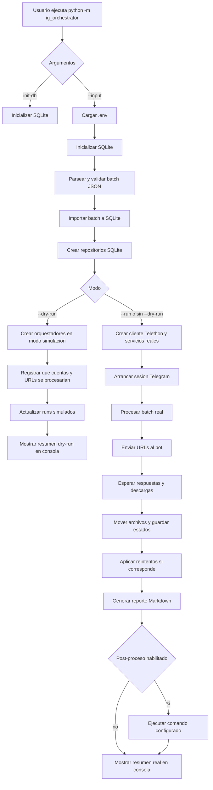
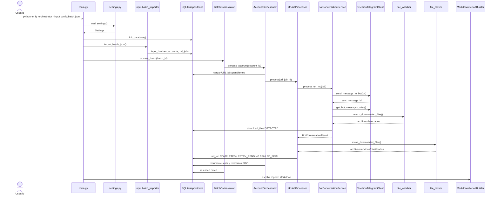

# ig_orchestrator

Orquestador para preparar, trazar y procesar descargas manuales de Instagram mediante un bot de Telegram.

El objetivo del proyecto es que el usuario escriba un lote de cuentas y URLs en JSON, la aplicacion lo importe a SQLite, procese las URLs en orden, use Telegram/Telethon para hablar con el bot de descarga, detecte los archivos que aparecen en la carpeta de Telegram Desktop, los mueva a una estructura por cuenta y deje trazabilidad en base de datos, logs y reportes.

Estado actual importante:

- El flujo real se ejecuta con `python -m ig_orchestrator --input config\batch.json` o con `--run`.
- El flujo real inicializa SQLite, importa el JSON, arranca Telethon, envia URLs al bot, espera descargas, mueve archivos y genera reporte Markdown.
- Cada `batch_name` se puede importar una sola vez. Una ejecucion interrumpida se retoma desde SQLite, nunca reimportando el mismo JSON.
- Un `--run` puede encadenar un lote nuevo con un lote pendiente, antes o despues.
- Tras importar un lote real se crea un backup en `config\bkp` y `batch.json` queda limpio para reutilizar sus cuentas.
- `--dry-run` sigue disponible para validar `.env`, JSON, SQLite y orquestacion sin Telegram y sin mover archivos.
- El orquestador puede ejecutar un post-proceso opcional despues del reporte.
  La configuracion interna de renombrado, duplicados y movimiento final sigue
  perteneciendo al script externo de Manual Rename Files.

## Que problema resuelve

El proceso manual original tiene muchas piezas dificiles de auditar: listas de URLs, mensajes al bot, descargas que aparecen en Telegram Desktop, carpetas por cuenta, errores temporales, errores definitivos y reintentos. Esta aplicacion intenta convertir ese proceso en una cola trazable:

1. Tomas un JSON con cuentas y URLs.
2. La aplicacion lo valida.
3. Lo importa a SQLite.
4. SQLite pasa a ser la fuente de verdad.
5. Cada URL se guarda como un trabajo individual.
6. Si una cuenta tiene `download_stories = true`, se genera automaticamente la URL de stories.
7. Las stories generadas se procesan antes que las URLs manuales.
8. Los errores temporales se reintentan por rondas, al final.
9. Los errores definitivos quedan guardados sin reintento.
10. Los archivos descargados se asocian a la URL que los produjo.
11. Los archivos se mueven a carpetas por tipo.
12. La ejecucion queda reconstruible desde SQLite, logs y reportes.

## Estructura principal

```text
config/
  app.example.json       Plantilla de configuracion futura persistible.
  batch.example.json     Plantilla de lote de entrada.
  batch.json             Lote real local para ejecutar o depurar.

data/
  orchestrator.db        SQLite local, ignorado por git.

logs/
  app.log                Log global.
  YYYYMMDD_HHMMSS/
    username.log         Log por cuenta/run.

reports/
  run_YYYYMMDD_HHMMSS.md Reporte Markdown cuando se invoque el builder.

src/ig_orchestrator/
  main.py                Punto de entrada actual.
  settings.py            Lectura de .env.
  input/                 Parser/importador/clasificador de URLs.
  db/                    SQLite, schema y repositorios.
  orchestration/         Orquestadores y politica de reintentos.
  telegram/              Telethon y parser de respuestas del bot.
  filesystem/            Carpetas, watcher, clasificacion y movimiento.
  reports/               Reporte Markdown desde SQLite.
```

## Entorno del proyecto

### `.venv`

`.venv` es un entorno virtual de Python. Sirve para instalar las dependencias de este proyecto sin ensuciar el Python global de Windows.

Se crea una vez:

```bash
python -m venv .venv
```

Se activa en PowerShell:

```powershell
.\.venv\Scripts\Activate.ps1
```

Despues instalas dependencias:

```bash
python -m pip install -r requirements.txt
```

VS Code puede usar ese Python para ejecutar tests y depurar. La configuracion actual de tests apunta a:

```text
${workspaceFolder}/.venv/Scripts/python.exe
```

### `.env`

`.env` es el archivo local con configuracion de ejecucion. No se debe commitear porque contiene credenciales o datos de entorno.

La aplicacion lo lee desde el root del proyecto con `load_settings()` en `src/ig_orchestrator/settings.py`.

Variables obligatorias actuales:

```env
TELEGRAM_API_ID=
TELEGRAM_API_HASH=
TELETHON_SESSION_NAME=telegram_user_session
TELEGRAM_DOWNLOAD_BOT_USERNAME=@example_bot

TELEGRAM_DESKTOP_DOWNLOAD_FOLDER=C:\Users\eduba\Downloads\DW\Telegram_Desktop
WORKING_FOLDER=C:\Users\eduba\Downloads\DW\Telegram_Desktop
REPORTS_FOLDER=reports
SQLITE_DB_PATH=data\orchestrator.db

MAX_RETRIES=5
RETRY_BASE_SECONDS=90
RETRY_MAX_SECONDS=900
DOWNLOAD_WAIT_TIMEOUT_SECONDS=300
DOWNLOAD_STABLE_SECONDS=10
```

Variables opcionales de post-proceso:

```env
POST_PROCESS_ENABLED=false
POST_PROCESS_COMMAND=D:\Archivos\Scripts\IG\ManualRenameFiles\MRF_auto.bat
```

`POST_PROCESS_COMMAND` debe apuntar a un comando generico, normalmente un
`.bat` o `.cmd`. Para Manual Rename Files se recomienda usar `MRF_auto.bat`,
sin `pause`, y dejar `MRF.bat` para lanzamientos manuales. El orquestador no
anade parametros de renombrado al `batch.json`: esos valores siguen viviendo
dentro del script externo o su wrapper.

Variables opcionales reservadas:

```env
FINAL_BASE_FOLDER=G:\4K Stogram\00.FAVORITES
MANUAL_RENAME_BAT_PATH=C:\path\to\ManualRenameFiles.bat
MANUAL_RENAME_CONFIG_PATH=C:\path\to\config.json
```

Notas:

- `TELEGRAM_API_ID` y `TELEGRAM_API_HASH` vienen de la aplicacion creada en Telegram.
- `TELETHON_SESSION_NAME` define el nombre base del archivo de sesion de Telethon.
- `TELEGRAM_DOWNLOAD_BOT_USERNAME` es el bot al que se enviaran las URLs.
- `TELEGRAM_DESKTOP_DOWNLOAD_FOLDER` es donde Telegram Desktop deja los archivos descargados.
- `WORKING_FOLDER` es la carpeta base donde el orquestador crea `username/`, `username/story/`, `username/reels/` y `username/highlights/`.
- `SQLITE_DB_PATH` define la base SQLite local.

### `pyproject.toml`

`pyproject.toml` describe el paquete Python:

- nombre del paquete;
- version;
- version minima de Python;
- dependencias runtime;
- layout `src`;
- configuracion de pytest.

Normalmente no tienes que tocarlo para ejecutar. Se modifica cuando cambia la version del proyecto, se anaden dependencias reales o cambia la configuracion de empaquetado/tests.

### `telegram_user_session.session`

`telegram_user_session.session` es el archivo de sesion de Telethon. Guarda la sesion local de tu usuario de Telegram para no pedir login en cada ejecucion.

El nombre sale de:

```env
TELETHON_SESSION_NAME=telegram_user_session
```

Si ese valor es `telegram_user_session`, Telethon crea o reutiliza:

```text
telegram_user_session.session
```

Si borras ese archivo, o cambias `TELETHON_SESSION_NAME`, Telethon tendra que iniciar sesion de nuevo la proxima vez que se use el cliente real. En ese primer login puede pedir telefono, codigo de Telegram y, si aplica, password 2FA. No subas nunca este archivo a git.

## Configuracion del batch

`config/batch.example.json` es una plantilla. El sufijo `example` significa que sirve como ejemplo seguro.

Para ejecutar o depurar usa un archivo real como:

```text
config/batch.json
```

Ejemplo:

```json
{
  "schema_version": "1.0",
  "batch_name": "descargas_16_junio_2026",
  "defaults": {
    "download_stories": false,
    "start_now_date": "2026-06-16"
  },
  "accounts": [
    {
      "username": "missess91",
      "start_now_date": "2026-06-16",
      "download_stories": true,
      "urls": [
        "https://www.instagram.com/p/DZnUzdJAtiV/?img_index=1"
      ]
    }
  ]
}
```

Campos:

- `schema_version`: version del contrato JSON.
- `batch_name`: nombre humano del lote. SQLite tambien crea un `id` automatico, pero `batch_name` ayuda a reconocer el lote en logs, DB y resumen.
- `defaults`: valores heredados por las cuentas.
- `accounts`: lista de cuentas a procesar.
- `username`: cuenta de Instagram.
- `start_now_date`: fecha `YYYY-MM-DD`, obligatoria por cuenta o heredada de `defaults`.
- `download_stories`: si es `true`, se genera `https://www.instagram.com/stories/{username}/`.
- `urls`: posts, reels, stories o highlights manuales.

Reglas de validacion:

- El JSON raiz debe ser un objeto.
- `batch_name` no puede estar vacio.
- Debe existir al menos una cuenta.
- Un `username` vacio se ignora.
- `start_now_date` debe ser `YYYY-MM-DD`.
- `download_stories` debe ser booleano.
- Las URLs deben usar dominio de Instagram.
- Las URLs vacias se ignoran y los duplicados se registran sin procesarse dos veces.
- Una cuenta con `download_stories = true` puede tener `urls: []`.
- Una cuenta con `download_stories = false` y sin URLs se ignora y se informa en consola/log.
- `batch_name` debe ser nuevo. Si ya existe en SQLite, `--run` termina con error y sugiere `run_continue`.
- Antes de insertar el lote, las cuentas se ordenan en memoria: primero las que
  solo descargan stories (`download_stories = true` y `urls: []`) y despues
  por numero ascendente de URLs procesables. Los empates mantienen el orden
  original del JSON.

## Como ejecutarlo

### Preparacion inicial

```powershell
cd d:\Archivos\Scripts\IG\Automatitation\ig_orchestrator
python -m venv .venv
.\.venv\Scripts\Activate.ps1
python -m pip install -r requirements.txt
copy .env.example .env
```

Despues edita `.env` con tus valores reales.

### Inicializar SQLite

```bash
python -m ig_orchestrator init-db
```

Tambien puedes pasar una ruta concreta:

```bash
python -m ig_orchestrator init-db --db-path data\orchestrator.db
```

### Ejecutar dry-run por linea de comando

```bash
python -m ig_orchestrator --input config\batch.json --dry-run
```

Salida esperada:

```text
Dry-run batch: descargas_16_junio_2026
Dry-run batch descargas_16_junio_2026: would process 1 pending account(s) and 6 URL(s); no Telegram messages sent and no files moved.
SQLite database: data\orchestrator.db
No Telegram messages were sent and no files were moved.
```

En dry-run:

- Se lee `.env`.
- Se inicializa SQLite si hace falta.
- Se importa `config/batch.json`.
- Se generan URL jobs, incluida la story generada si aplica.
- Se crean runs simulados en SQLite.
- Se escriben logs.
- No se envia nada a Telegram.
- No se mueven archivos.
- No se crean carpetas de cuenta por defecto.

### Ejecutar descarga real

```bash
python -m ig_orchestrator --input config\batch.json
```

Tambien puedes usar el modo explicito:

```bash
python -m ig_orchestrator --input config\batch.json --run
```

Este modo:

- Inicializa SQLite si hace falta.
- Rechaza el JSON si su `batch_name` ya existe.
- Importa un batch nuevo y registra sus usernames en `account_history`.
- Inserta y procesa primero las cuentas de solo stories; las demas se ordenan
  de menos a mas URLs para dejar al final las cuentas con mas descargas.
- Crea `config\bkp\{batch_name}_batch.json`.
- Limpia cada cuenta del JSON original dejando `username`, `start_now_date`, `download_stories: false` y `urls: []`.
- Arranca Telethon con la sesion indicada por `TELETHON_SESSION_NAME`.
- Procesa cuentas pendientes.
- Procesa primero stories generadas.
- Envia despues las URLs manuales al bot.
- Detecta archivos nuevos en `TELEGRAM_DESKTOP_DOWNLOAD_FOLDER`.
- Mueve archivos a `WORKING_FOLDER\username\...`.
- Aplica reintentos FIFO para errores temporales.
- Guarda estados, errores y archivos en SQLite.
- Genera un reporte Markdown en `REPORTS_FOLDER`.
- Si `POST_PROCESS_ENABLED=true`, y el batch no tuvo fallo de infraestructura,
  ejecuta `POST_PROCESS_COMMAND` despues de generar correctamente el reporte.
  Si ese comando falla, el batch y el reporte quedan informados como correctos,
  pero el proceso termina con fallo de post-proceso.

Salida orientativa:

```text
Batch processed: descargas_16_junio_2026
Completed 6/6 URLs; failed final 0; files 12.
SQLite database: data\orchestrator.db
Markdown report: reports\run_20260616_101530.md
```

### Continuar un lote interrumpido

```bash
python -m ig_orchestrator run_continue --batch-id 10
python -m ig_orchestrator run_continue --batch-name descargas_21_junio_2026
```

Sin selector, `run_continue` procesa todos los lotes con trabajo reanudable.

### Combinar pendientes con un lote nuevo

Primero termina el lote pendiente 10 y despues procesa el lote nuevo:

```bash
python -m ig_orchestrator --input config\batch.json --run --join-after-pending-batch-id 10
```

Primero procesa el lote nuevo y despues termina el lote pendiente 10:

```bash
python -m ig_orchestrator --input config\batch.json --run --join-before-pending-batch-id 10
```

Los lotes permanecen separados en SQLite y generan runs/reportes separados. El
id indicado debe existir y contener cuentas/URLs en estado reanudable.

### Ejecutar desde VS Code

Abre `.vscode/launch.json`.

Configuraciones disponibles:

- `Ejecutar: ig_orchestrator`: ejecuta el modo real sin depurador.
- `Depurar: ig_orchestrator`: ejecuta el modo real con breakpoints.
- `Tests: pytest`: ejecuta tests.
- `Depurar: dry-run batch`: dry-run con depurador.

Las configuraciones principales usan:

```json
"args": [
  "--input",
  "config/batch.json",
  "--run"
]
```

Para depurar:

1. Pon breakpoints en `src/ig_orchestrator/main.py`, `input/batch_importer.py` u `orchestration/batch_orchestrator.py`.
2. Selecciona `Depurar: ig_orchestrator`.
3. Pulsa `F5`.
4. Mira la terminal integrada, SQLite y logs.

## Flujo de ejecucion actual



Los dos modos comparten carga de `.env`, inicializacion de SQLite, validacion del JSON, importacion a SQLite y repositorios. La diferencia es que `--dry-run` se detiene en una simulacion trazable; `--run` arranca Telethon, habla con el bot, observa descargas, mueve archivos y escribe reporte.

## Flujo real entre modulos

Este diagrama describe como interactuan los modulos en una ejecucion real.



## Que hace cada modulo

- `main.py`: punto de entrada. Soporta `init-db`, `--input ... --run` y `--input ... --dry-run`.
- `settings.py`: lee `.env`, valida variables obligatorias y convierte rutas/numeros.
- `input/batch_json_parser.py`: valida el JSON de entrada.
- `input/batch_importer.py`: guarda batch, cuentas, settings no sensibles y URLs en SQLite.
- `input/url_classifier.py`: clasifica URLs como `POST`, `REEL`, `STORY`, `HIGHLIGHTS` o `UNKNOWN`.
- `db/*_repository.py`: encapsula lecturas/escrituras SQLite.
- `orchestration/batch_orchestrator.py`: procesa cuentas pendientes de un lote.
- `orchestration/post_processing.py`: ejecuta el comando opcional posterior al reporte.
- `orchestration/account_orchestrator.py`: ordena URLs, crea carpetas en modo real y aplica reintentos FIFO.
- `orchestration/retry_policy.py`: calcula si reintentar, cuanto esperar o marcar fallo final.
- `orchestration/url_job_processor.py`: procesa una URL, invoca Telegram, mueve archivos y actualiza estados.
- `telegram/telegram_client.py`: wrapper asincrono de Telethon.
- `telegram/bot_conversation_service.py`: envia URL al bot, lee respuestas, detecta errores y observa descargas.
- `telegram/bot_response_parser.py`: clasifica respuestas del bot.
- `filesystem/file_watcher.py`: detecta archivos nuevos/estables en la carpeta de Telegram.
- `filesystem/file_classifier.py`: clasifica extensiones como imagen, video o unknown.
- `filesystem/file_mover.py`: mueve descargas a la carpeta correcta.
- `reports/markdown_report_builder.py`: reconstruye un reporte Markdown desde SQLite.
- `logging_config.py`: configura `logs/app.log` y logs por cuenta.

## SQLite

La base configurada por defecto es:

```text
data\orchestrator.db
```

Tablas principales:

- `app_config`: configuracion operativa no sensible importada desde settings.
- `input_batches`: lotes importados.
- `accounts`: cuentas dentro de cada lote.
- `account_history`: usernames conocidos globalmente, sin repetir entre lotes.
- `url_jobs`: una fila por URL, incluida la story generada.
- `download_files`: archivos detectados/movidos.
- `runs`: ejecuciones y resumen.

La migracion se aplica automaticamente con `init-db` y tambien al iniciar una
ejecucion. La sentencia de creacion es:

```sql
CREATE TABLE IF NOT EXISTS account_history (
    id INTEGER PRIMARY KEY AUTOINCREMENT,
    user_ig_id TEXT,
    user_name TEXT NOT NULL COLLATE NOCASE,
    status TEXT NOT NULL DEFAULT 'ENABLED',
    field1 TEXT,
    field2 TEXT,
    created_at TEXT NOT NULL,
    updated_at TEXT NOT NULL
);

CREATE UNIQUE INDEX IF NOT EXISTS uq_account_history_user_name
ON account_history(user_name COLLATE NOCASE);
```

`status` admite `ENABLED`, `DISABLED` y `CHANGED`. `user_ig_id`, `status`,
`field1` y `field2` quedan disponibles para actualizacion manual o para otro
proceso futuro. Un mismo `user_ig_id` puede aparecer con usernames distintos.

Puedes inspeccionarla con cualquier visor SQLite o con la CLI de SQLite si la tienes instalada.

Estados relevantes:

- Batch: `IMPORTED`, `PROCESSING`, `COMPLETED`, `PARTIAL`, `FAILED`.
- Cuenta: `PENDING`, `PROCESSING`, `COMPLETED`, `FAILED`, `PARTIAL`.
- URL: `PENDING`, `SENT_TO_BOT`, `WAITING_DOWNLOAD`, `DOWNLOADED`, `RETRY_PENDING`, `FAILED_TEMPORARY`, `FAILED_FINAL`, `CLASSIFIED`, `COMPLETED`.
- Archivo: `DETECTED`, `MOVED_TO_WORKING_FOLDER`, `CLASSIFIED_AS_REEL`, `CLASSIFIED_AS_POST`, `CLASSIFIED_AS_STORY`, `CLASSIFIED_AS_HIGHLIGHTS`, `FINALIZED`.

## Reglas de clasificacion

URLs:

- `/stories/highlights/...` -> `HIGHLIGHTS`
- `/stories/{username}/` -> `STORY`
- `/reel/...` -> `REEL`
- `/p/...?...img_index=...` -> `POST`
- `/p/...` sin `img_index` -> inicialmente `REEL`
- rutas Instagram desconocidas -> `UNKNOWN`

Archivos:

- Imagen: `.jpg`, `.jpeg`, `.png`, `.webp`
- Video: `.mp4`, `.mov`, `.mkv`, `.webm`
- Otro: `UNKNOWN`

Correccion posterior:

- Si una URL clasificada inicialmente como `REEL` descarga solo imagenes, se corrige a `POST`.

## Rutas de salida

### Logs

Log global:

```text
logs\app.log
```

Log por cuenta/run:

```text
logs\YYYYMMDD_HHMMSS\username.log
```

`YYYYMMDD_HHMMSS` se fija una sola vez al arrancar el comando. Una ejecucion
con varias cuentas, varios batches unidos o reintentos conserva siempre esa
misma carpeta. Si el mismo username vuelve a procesarse dentro de la ejecucion,
su contenido se agrega al mismo `username.log`.

Los logs incluyen `run_id` y `account_username`. El logger intenta redactar claves sensibles como `api_hash`, `token`, `session`, `phone`, `code`, etc.

### Descargas y carpetas de trabajo

Telegram Desktop descarga inicialmente en:

```text
TELEGRAM_DESKTOP_DOWNLOAD_FOLDER
```

El orquestador mueve a:

```text
WORKING_FOLDER\username\
WORKING_FOLDER\username\story\
WORKING_FOLDER\username\reels\
WORKING_FOLDER\username\highlights\
```

Reglas:

- `STORY` -> `username\story\`
- `HIGHLIGHTS` -> `username\highlights\`
- `REEL` con video -> `username\reels\`
- `POST` con imagen -> `username\`
- Si el destino existe, se agrega sufijo numerico: `archivo_1.jpg`, `archivo_2.jpg`, etc.

En dry-run no se mueven archivos ni se crean carpetas de cuenta por defecto.

### Reportes

El builder de reportes escribe en:

```text
REPORTS_FOLDER\run_YYYYMMDD_HHMMSS.md
```

El reporte contiene una tabla:

```text
Username | Tipo | Urls | Fichero | Estado | Directory
```

En ejecucion real el entrypoint genera el reporte al terminar el batch. En dry-run no se genera automaticamente.

## Reintentos y errores esperados

Errores reintentables del bot:

```text
The service is overloaded, please try again later.
geoblock_required
Media not found or unavailable
```

Errores definitivos, sin reintento:

```text
We're sorry, we couldn't find that.
Stories for {username} not found
We can't get stories from a private account (instagram limit)
```

Otros errores comunes:

- Variables faltantes en `.env`: el comando falla con `Missing required environment variables`.
- JSON invalido: se indica linea/columna o campo problematico.
- Fecha invalida: `start_now_date must use YYYY-MM-DD format`.
- URL no Instagram: `must use an Instagram domain`.
- Sin archivos detectados tras enviar URL: se marca como reintentable.
- Fallo al mover archivo: se marca como reintentable con `MOVE_FILES_FAILED`.
- Telethon no instalado: instalar dependencias.
- Sesion Telethon invalida o ausente: Telethon pedira login cuando se use el cliente real.

Politica:

- Los reintentos no son inmediatos mientras queden URLs nuevas.
- Primero se procesan stories generadas.
- Despues se procesan URLs manuales.
- Al final se procesa la cola FIFO de reintentos.
- Tras `MAX_RETRIES`, se marca `FAILED_FINAL`.
- Backoff por defecto: 90, 180, 360, 720, 900 segundos.

`Stories for {username} not found` se reconoce como patron dinamico. Por
ejemplo, `Stories for superlisha not found` termina directamente como
`FAILED_FINAL`, con `last_error_type = STORIES_NOT_FOUND`.

En stories mixtas se descargan tanto videos como fotos. Los videos conservan el
nombre entregado por Telegram cuando existe. Las fotos sin nombre original se
guardan con:

```text
username-YYYYMMDD_HHMMSS.jpg
username-YYYYMMDD_HHMMSS_1.jpg
```

## Como saber que termino

En dry-run:

- El proceso termina cuando la consola muestra `No Telegram messages were sent and no files were moved.`
- El exit code debe ser `0`.
- SQLite contiene el batch, cuentas, URLs y runs simulados.
- Los logs quedan en `logs`.

En ejecucion real prevista:

- El batch termina con estado `COMPLETED`, `PARTIAL` o `FAILED`.
- El run tiene `finished_at`.
- La consola/log muestra resumen final.
- Cada URL queda en estado terminal, normalmente `COMPLETED` o `FAILED_FINAL`.
- El reporte Markdown queda escrito en `reports`.
- Si el post-proceso esta habilitado, la consola indica `Manual rename post-processing: success`
  o muestra el codigo de salida/error del comando externo.

## Tests

Ejecutar todos:

```bash
python -m pytest
```

Desde VS Code usa la configuracion:

```text
Tests: pytest
```

## Seguridad

No commitear:

- `.env`
- `*.session`
- `*.session-journal`
- bases SQLite reales: `data/*.db`, `*.sqlite`, `*.sqlite3`
- logs reales si contienen trazas personales

El `.gitignore` ya cubre estos archivos.

## Limitaciones actuales

- El reporte Markdown no se genera automaticamente en el dry-run actual.
- El orquestador solo invoca un comando externo de post-proceso. La logica de
  renombrado, limpieza de duplicados y movimiento final a `G:\4K Stogram` sigue
  fuera de este proyecto y pertenece a Manual Rename Files.
